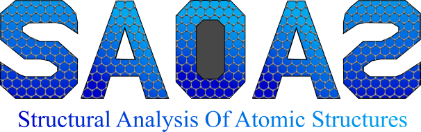

# MEM-saoas

`saoas` (Structural Analysis of Atomic Systems) is a C++ implementation of the
**Molecular Element Method (MEM)**: a FEM-based formulation for the linear
elastic analysis of atomic structures (static response and normal-mode /
vibrational analysis) from a classical force field.

Theoretical background:

- A. Fernández-San Miguel, I. Couceiro & L. Ramírez, *The Molecular Element
  Method (MEM): A FEM-based Formulation for Linear and Non-Linear Molecular
  Elasticity*.
  [ruc.udc.es](https://ruc.udc.es/entities/publication/d0df64f6-4666-431f-9fbd-0e0f903c5b06)
- A. Fernández-San Miguel, I. Couceiro, L. Ramírez & F. Navarrina, *A first
  order FEM-based formulation for the analysis of molecular structures with
  bonded interactions*, Engineering with Computers.
  [Springer](https://link.springer.com/article/10.1007/s00366-024-02085-w)

  ## Tutorials

You can find tutorials and additional documentation on my website:

[MEM Tutorials](https://andresfernandezsanmiguel.github.io/MEM/)

## Dependencies

- C++17 compiler
- CMake ≥ 3.14
- [Eigen](https://eigen.tuxfamily.org) (header-only)
- [Spectra](https://spectralib.org) (header-only, built on Eigen)

Eigen and Spectra are downloaded automatically at configure time via CMake
`FetchContent` — no manual installation needed.

This produces the `saoas` executable inside `build/`.

## Usage

`saoas` reads its input from a file named `datos.txt`, which must be present
in the working directory when the executable is run:

```bash
./saoas
```

### Input file: `datos.txt`

The parser expects a fixed-layout text file. Header block:

```
...
modo=<S|RV|free>
...
nnodo=<N>
neles=<number of bonds>
nelan=<number of angles>
neldi=<number of dihedrals>
```

- `modo` selects the analysis type:
  - `S` — static analysis only (`K u = f`), no eigenproblem.
  - `RV` — restrained vibrational analysis: `K` is positive-definite
    (constrained DOFs removed), solved with a shift-invert Cholesky operator.
  - any other value — treated as a **free molecule**: `K` is positive
    semi-definite (6 rigid-body modes), solved as the generalized eigenproblem
    `K φ = λ M φ` in Cholesky mode; the 6 zero-eigenvalue rigid modes are
    excluded automatically.

Followed by, in order:

1. **Atomic data** (`nnodo` lines): `N_i m x y z` and, only if `modo` is `S`
   or `RV`, six additional columns `u v w fx fy fz` where `u,v,w ∈ {0,1}` flag
   free (1) / restrained (0) DOFs and `fx,fy,fz` are the applied nodal forces.
2. **Bonds** (`neles` lines): `i j k_l` — bonded pair and stretching stiffness.
3. **Angles** (`nelan` lines): `i j k k_o` — bonded triplet (vertex `j`) and
   bending stiffness.
4. **Dihedrals** (`neldi` lines): `i j k l k_p` — bonded quadruplet and
   torsional stiffness.

Node indices are 0-based. See the parsing logic in `lectura()` / `dim()` in
`src/saoas.cpp` for the exact line offsets if you need to adapt the format.

At runtime, if `modo != "S"`, the program interactively asks for:

- number of eigenvalues/eigenvectors to compute,
- an eigenvalue threshold (`lamlim`) below which modes are discarded,
- (during static output generation) a displacement scale factor and number
  of frames for the deformation trajectory,
- a scale factor for the normal-mode output.

### Output files

- `disp.txt` — global displacement vector `u` from the static solve.
- `autoval.txt` — converged eigenvalues above `lamlim`.
- `normal.nmd` — normal modes in [ProDy](http://prody.csb.pitt.edu/)/NMD
  format (viewable in VMD's Normal Mode Wizard).
- `deformation.pdb` — multi-model PDB trajectory interpolating from the
  original to the scaled deformed geometry, with the per-atom displacement
  magnitude written to the B-factor column for color mapping in VMD.

## License

This project is distributed under the **PolyForm Noncommercial License
1.0.0** — free for any noncommercial purpose (personal, academic, research,
educational, charitable, governmental), but **not licensed for commercial
use**. See [`LICENSE`](./LICENSE) for the full text.

For commercial licensing inquiries, contact: `<your-email>`.

> Before publishing, remember to fill in `[YEAR]` / `[YOUR NAME OR
> INSTITUTION]` in the `LICENSE` file, and check with your university's
> tech-transfer office if the code was developed under an institutional or
> funded project, since ownership terms may apply.

## Citing

If you use this code in your research, please cite the two references listed
above. A machine-readable `CITATION.cff` is included in this repository —
GitHub will automatically show a **"Cite this repository"** button on the
repo page once it's uploaded.
